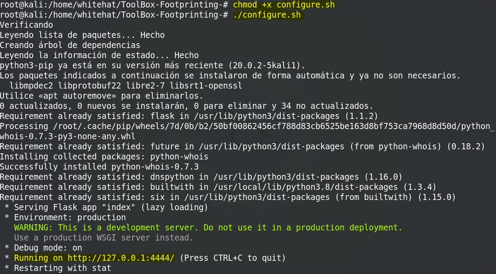

## ToolBox {Footprinting}
ToolBox {Footprinting} es un conjunto de herramientas desarrolladas en python que permiten realizar la recolección de información sobre un objetivo. Entre estas mismas se encuentran:

* WHOIS: base de datos publica para consultar el propietario de un dominio o dirección ip.

* DNS: Asocia informacion sobre un dominio web y sus diferentes registros como, servidores de correo, servidores de nombre y registro de direcciones ip.

* CONSTRUCTED: Obtiene la diferentes tecnologias y servicios de aplicativos web.

### Dependencias

* flask

* whois

* dnspython

* buitwith

### Ejecución

El script configure.sh, ya esta configurado por defecto para intalar las dependencias de la herramienta, solo es cuestion de darle permisos de ejecución y ejecutarlo, es necesario que dicho proceso se ejecute en un nivel ROOT.

	

